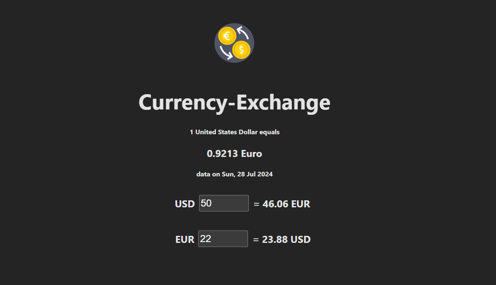

# Project "Currency Exchange"

## Vercel link: [click](https://currency-exchange-rust.vercel.app/)

## Project Description:

A simple currency exchange application built with React, TypeScript, and Vite. This app allows users to convert between Euros and US Dollars, providing real-time exchange rate updates. It features a clean and intuitive interface, ensuring a smooth user experience.

## Installation:
```sh
git clone https://github.com/xocoee/currency-exchange.git
cd currency-exchange
make install
```
```sh
make start
```

## Demonstration:
